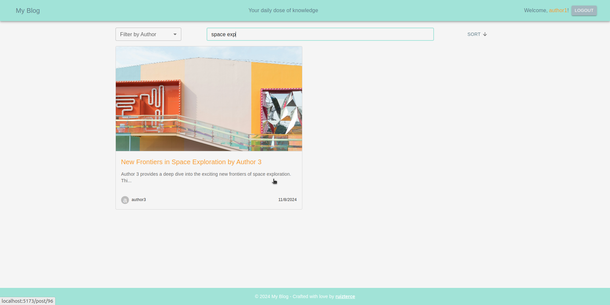

# blog-api

## Multi-Frontend Blogging Platform with Backend API

This project demonstrates the design of a blogging platform that separates backend and frontend functionalities into three parts: a backend API and two distinct frontend interfaces.

## Components

### 1. Backend API

The backend API is the backbone of the platform, built using [Node.js](https://nodejs.org/) with [Express](https://expressjs.com/). It manages data and logic using:

- [prisma](https://www.prisma.io/docs/) for database interaction with a [PostgreSQL](https://www.postgresql.org/) database.
- [bcrypt](https://www.npmjs.com/package/bcrypt) for secure password hashing.
- [jsonwebtoken](https://www.npmjs.com/package/jsonwebtoken) and [passport](http://www.passportjs.org/) for user authentication and authorization.
- [multer](https://www.npmjs.com/package/multer) for handling file uploads.
- [dotenv](https://www.npmjs.com/package/dotenv) for environment variable management.
- [cors](https://www.npmjs.com/package/cors) to manage cross-origin requests.

Key functionalities include user management, content delivery, and data management through RESTful endpoints.

### 2. Frontend

This project consists of two separate frontends: one designed for general visitors and the other tailored for administrators and blog authors. Both are single-page applications (SPAs) built with [React](https://reactjs.org/) and powered by [Vite](https://vitejs.dev/). They feature:

- [@mui/material](https://mui.com/material-ui/) and [@mui/icons-material](https://mui.com/material-ui/icons/) for a responsive and intuitive UI.
- [axios](https://axios-http.com/) for seamless API calls to fetch blog content.
- [react-router-dom](https://reactrouter.com/) for navigation between different views as a single-page app.

The public frontend allows users to explore blog posts and leave comments, while the authors' frontend provides tools for managing, creating, updating, and deleting posts.

#### Public frontend

##### Desktop

##### Mobile

#### Authors' frontend

